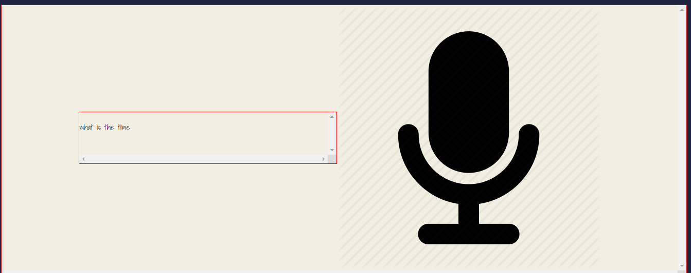

# speechapp
simple app Speech Recognition 

added options assistant:
  Speech :
  const dictate = () => {
  recognition.start();
  recognition.onresult = (event) => {
    const speechToText = event.results[0][0].transcript;
    
    paragraph.textContent = speechToText;

    if (event.results[0].isFinal) {

      if (speechToText.includes('what is the time')) {
          speak(getTime);
      };
      
      if (speechToText.includes('what is today\'s date')) {
          speak(getDate);
      };
      
      if (speechToText.includes('what is the weather in')) {
          getTheWeather(speechToText);
      };
    }
  }
}

